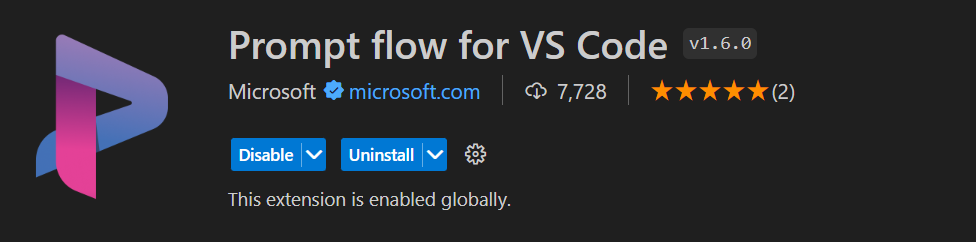
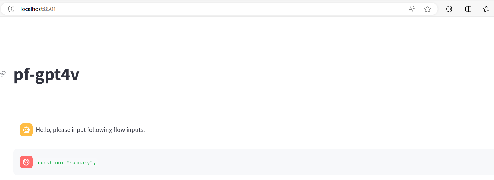

# README
The codebase builds a chat with your video promptflow. It uses GPT4V and Azure AI Computer Vision services. 
The flow allows you to:
- Chat with your video file

To modify the system message, go to [QuestionGPT](/question_gpt4v.py)

The inputs to the promptflow are as follows:
- "question": The question you want to ask over the video 
- "video_id": ID of the indexed video, 
- "video_index_name": Name of the index
- "video_sas_url": SAS URL of the video file. The video should be uploaded to a BLOB store and SAS URL to be provided as input

## Pre-requisites
1. Azure OpenAI Service with GPT4 Vision model deployed
2. Azure AI Service -Computer  Vision service
3. Azure Machine Learning Workspace - (Optional) needed to run promptflow on Azure
4. Python 3.10+ - (Optional) To execute code locally
5. Video uploaded to a BLOB store and SAS URL generated
6. Video indexed within the CV service - see create_video_index.py to index a video in your computer vision service

## Run on Azure Machine Learning Workspace
1. Clone this repository in your local machine
2. Login to the Azure Portal and navigate Azure Machine Learning
3. Create a compute instance
4. Create a promptflow runtime
5. Create a Custom Connection and name it "CREDENTIALS". Provide the following keys and values:
    - VISION_API_ENDPOINT
    - GPT_4V_ENDPOINT
    - GPT_4V_KEY (Please select the secret checkbox)
    - VISION_API_KEY (Please select the secret checkbox)
6. Navigate to the flow and start testing

## Run locally using VSCode - provides an interactive CLI or Streamlit app to test the flow
1. Install Promptflow for VSCode extension in VSCode

2. Create conda env or venv (optional) - `python -m venv .venv`
3. Install dependecies - `pip install -r requirements.txt`
4. Create connection
    1. Edit the yaml/connection.yaml file
    2. Execute command - `pf connection create -f yaml/connection.yaml`
5. Start testing - `pf flow test --flow "<path to the flow.dag.yaml file" --interactive --multi-modal`

The above step should redirect you to a local browser with a view like this:

If you face any error, try the `pf flow` command without the --multi-modal input, this should allow you to test the code in an interactive manner on the CLI

